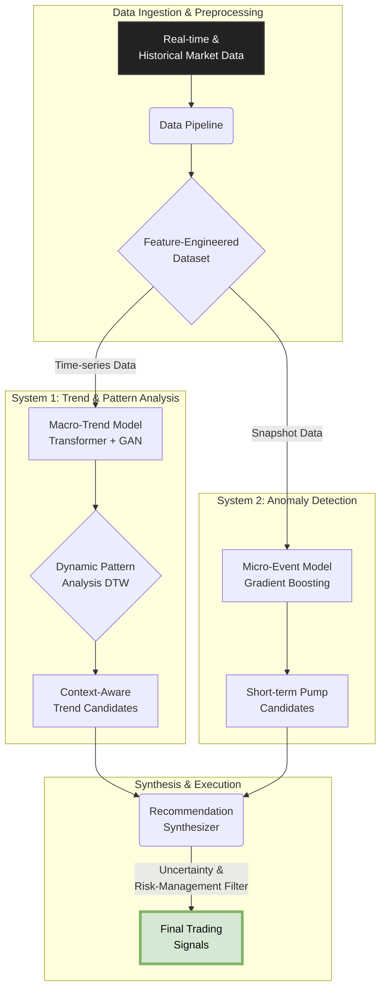

# 🤖 Chrono-Trader: A Hybrid AI Framework for Multi-faceted Cryptocurrency Market Prediction


[](https://opensource.org/licenses/MIT)


---

## Abstract

> This document introduces **Chrono-Trader**, a novel framework for algorithmic cryptocurrency trading designed to address the market's inherent volatility and non-linearity. We propose a dual-system architecture that operates in parallel: (1) a **Transformer-GAN based model** for forecasting macroscopic market trends and identifying pattern-following opportunities, and (2) a **Gradient Boosting (XGBoost) model** for the classification of microscopic, short-term pump events. The core contribution of this research lies in its synergistic application of deep learning for time-series analysis and machine learning for anomaly detection, synthesized through a risk-aware recommendation engine. This hybrid approach allows for a more holistic understanding of market dynamics than single-model systems.

---

## 1. Introduction

The cryptocurrency market's high volatility and non-linear characteristics present significant challenges for traditional financial prediction models. Simple predictive systems often fail to capture the market's dual nature, which is driven by both long-term trends and short-term speculative events. To tackle this, we developed **Chrono-Trader**, a system designed to analyze and act on these distinct market phenomena concurrently.

## 2. Proposed Method

### 2.1. System Architecture

Our framework is composed of two specialized, parallel-processing AI systems that feed into a final recommendation synthesizer. This design allows each model to focus on the task for which it is best suited.



### 2.2. Key Methodologies

- **Hybrid AI Modeling:** A state-of-the-art **Transformer-GAN architecture** is employed for robust time-series forecasting, capturing long-range dependencies. This is complemented by a powerful **Gradient Boosting model (XGBoost)** for high-speed classification of pump-and-dump indicators.

- **Multi-Scale Convolutional Analysis:** The trend model incorporates a **multi-scale 1D CNN** layer, allowing the system to simultaneously analyze market data across different temporal resolutions for richer, more nuanced feature extraction.

- **Dynamic Time Warping (DTW) for Pattern Discovery:** The system moves beyond simple correlation by using **DTW** to identify non-linear similarities between price action. This enables the discovery of "follower" assets that mimic the pre-breakout patterns of market "leaders."

- **Adaptive System Parameters:** Key system parameters, such as market index composition and training data look-back periods, are **dynamically adjusted** based on recent market volatility and volume, ensuring the model adapts to changing market regimes.

## 3. System Implementation & Usage

- **Technology Stack:** `Python`, `PyTorch`, `Pandas`, `scikit-learn`, `XGBoost`, `SQLite`
- **Primary Execution Command:**
  ```bash
  # Executes the full daily pipeline: screening, model fine-tuning, and recommendation.
  python main.py --mode daily
  ```

## 4. Ongoing & Future Research

This project serves as a foundation for further research. Key areas for future work include:
-   Research on applying model uncertainty for dynamic, risk-adjusted position sizing.
-   Integration of macroeconomic indicators and on-chain data to enrich the feature set.
-   Development of a reinforcement learning agent for optimizing trade execution and portfolio management.
