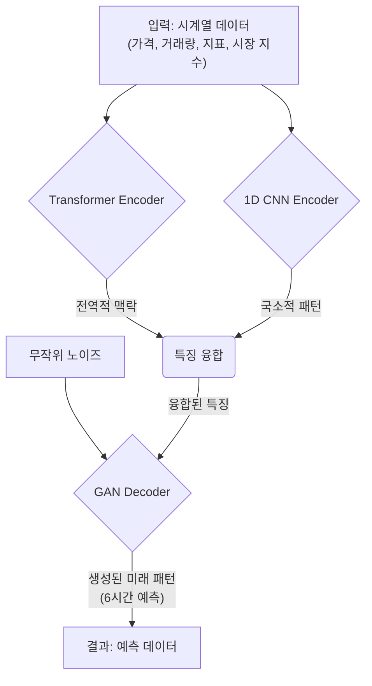
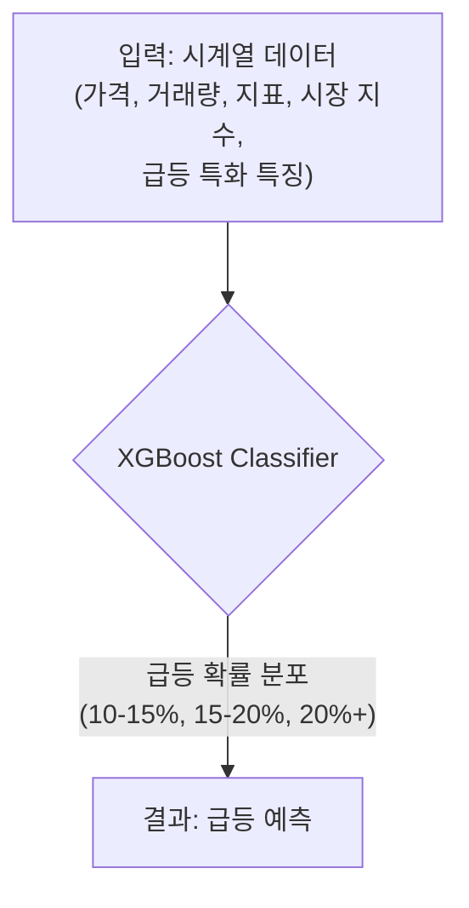

<div align="center">

# 🤖 Chrono-Trader 📈

**최첨단 하이브리드 AI 기반 암호화폐 예측 및 추천 엔진**

</div>

<div align="center">

[](https://opensource.org/licenses/MIT) 
[](https://www.python.org/downloads/) 
[](https://pytorch.org/) 
[](https://github.com/huggingface/transformers)

</div>

**Chrono-Trader**는 시장의 복잡한 패턴을 분석하고, 잠재력 높은 거래 기회를 포착하는 암호화폐 예측 및 추천 엔진입니다. **하이브리드 AI 모델**을 통해 시장의 깊은 맥락과 국소적인 패턴을 동시에 이해하며, **다중 분류 급등 예측 모델**로 단기적인 고수익 기회를 탐색합니다. 지속적인 데이터 학습 및 모델 미세조정을 통해 변화하는 시장에 끊임없이 적응합니다.

---

## ✨ 주요 특징

- **🧠 하이브리드 AI 모델 (시스템 1)**: **Transformer**가 시장의 전반적인 맥락을 이해하고, **1D CNN**이 국소적인 가격 패턴(급등/급락)을 포착합니다. 이 두 정보가 융합되어 **GAN Decoder**가 현실적인 미래 가격 시나리오를 생성합니다.
- **🚀 다중 분류 급등 예측 (시스템 2)**: **XGBoost** 기반의 모델이 향후 6시간 내 +10% 이상 급등할 코인을 포착하고, 그 **급등폭의 분포(10-15%, 15-20%, 20%+)**까지 예측합니다.
- **📊 시장 맥락 인지**: '시장 지수 수익률'을 학습 변수로 사용하여, 모델이 시장 전체의 흐름을 지능적으로 고려하여 예측합니다. (외부 필터 제거)
- **🛡️ 견고한 모델 관리**: 모델 저장 및 로딩 방식을 개선하여, 하이퍼파라미터 튜닝으로 모델 구조가 변경되어도 안정적으로 동작합니다.
- **🤖 앙상블 학습**: 세 개의 독립적인 하이브리드 모델을 함께 사용(Ensemble)하여 예측의 안정성과 신뢰도를 극대화합니다.
- **🔄 지속적인 학습 및 최적화**: `daily` 파이프라인을 통해 최신 데이터를 자동으로 수집하고, 모델을 점진적으로 개선하여 시장 변화에 대응합니다。

## 🛠️ 기술 스택

| 구분      | 기술                                                                                                        |
|-----------|-------------------------------------------------------------------------------------------------------------|
| **주요 언어** | Python 3.8+                                                                                                 |
| **AI/ML** | PyTorch, Transformers (Hugging Face), Scikit-learn, Optuna (하이퍼파라미터 튜닝), pandas-ta, XGBoost        |
| **데이터**    | Pandas, NumPy, SQLite                                                                                       |
| **유틸리티**  | Argparse (CLI), Logger, Requests                                                                            |

## 🏛️ 모델 아키텍처

**Chrono-Trader**는 두 가지 핵심 시스템으로 구성됩니다.

### **시스템 1: 하이브리드 예측 엔진 (Transformer + CNN + GAN)**

**Transformer Encoder**와 **1D CNN Encoder**가 시계열 데이터를 병렬로 분석하여 각각 전역적인 시장 맥락과 국소적인 패턴을 추출합니다. 이 두 가지 강력한 특징은 융합 과정을 거쳐 **GAN Decoder**에 전달되며, GAN Decoder는 이를 바탕으로 현실적인 미래 6시간 가격 패턴을 생성합니다。



### **시스템 2: 급등 포착 엔진 (XGBoost)**

**XGBoost Classifier**는 가격, 거래량, 지표, 시장 지수 및 급등 특화 특징을 입력으로 받아, 향후 6시간 내 발생할 급등의 확률 분포(10-15%, 15-20%, 20%+)를 예측합니다。



## 🚀 시작하기

### 1. 사전 준비

Python 3.8+ 버전이 시스템에 설치되어 있어야 합니다. (더 이상 `TA-Lib` C 라이브러리 설치는 필요 없습니다.)

### 2. 설치

저장소를 복제(clone)하고, 가상환경 내에 필요한 Python 패키지를 설치합니다.

```bash
# 저장소 복제
git clone https://github.com/soccz/Chrono-Trader.git
cd Chrono-Trader

# 가상환경 생성 및 활성화
python3 -m venv venv
source venv/bin/activate

# 의존성 설치
pip install -r requirements.txt
```

### 3. 사용법

`main.py` 스크립트를 통해 다양한 모드로 실행할 수 있습니다.

- **데이터베이스 초기화 (최초 1회 실행):**
  ```bash
  python main.py --mode init_db
  ```

- **전체 모델 재훈련 (필수):**
  ```bash
  # 1. 메인 모델 훈련 (하이퍼파라미터 튜닝 포함)
  python main.py --mode train --tune --days 90
  # 2. 급등 예측 모델 훈련
  python main.py --mode train-pump
  ```

- **일일 추천 파이프라인 실행:**
  ```bash
  # 최신 데이터 수집, 모델 미세조정, 추천 및 급등 예측 생성을 모두 수행합니다.
  python main.py --mode daily
  ```

- **급등 예측만 실행:**
  ```bash
  # 급등 예측 모델을 사용하여 현재 시장의 급등 가능성 코인을 찾습니다.
  python main.py --mode find-pumps
  ```

## 📈 전체 예측 정확도 분석 방법

이 프로젝트는 과거에 생성된 모든 예측의 정확도를 종합적으로 분석하는 기능을 제공합니다. 이 과정은 대량의 데이터를 효율적으로 처리하기 위해 다음과 같은 3단계로 구성됩니다.

1.  **전체 예측 데이터 통합**
    *   `recommendations/` 폴더에 흩어져 있는 모든 `recs_*.csv` 파일들을 `all_predictions.csv`라는 하나의 파일로 통합합니다.

2.  **전체 가격 데이터 추출**
    *   `crypto_data.db` 데이터베이스에서 모든 시세 데이터를 `all_prices.csv` 파일로 한 번에 추출합니다.

3.  **통합 데이터 분석**
    *   위에서 생성된 두 개의 대용량 CSV 파일(`all_predictions.csv`, `all_prices.csv`)을 읽어, 각 예측에 대한 실제 결과를 매칭하고, 전체 예측에 대한 평균 **방향 정확도(Directional Accuracy)**와 **평균 절대 오차(MAE)**를 계산합니다。

이 과정을 통해 모델의 전체적인 성능을 객관적으로 평가할 수 있습니다.

## 📜 라이선스

이 프로젝트는 MIT 라이선스를 따릅니다. 자세한 내용은 [LICENSE](LICENSE) 파일을 참고하세요。
