<div align="center">

# 🤖 Chrono-Trader 📈

**하이브리드 Transformer-GAN 기반 암호화폐 예측 및 추천 엔진**

</div>

<div align="center">

[](https://opensource.org/licenses/MIT)
[](https://www.python.org/downloads/)
[](https://pytorch.org/)
[](https://github.com/huggingface/transformers)

</div>

**Chrono-Trader**는 최첨단 하이브리드 AI 모델을 활용하여 시장의 패턴을 분석하고, 잠재력 높은 거래 기회를 포착하는 암호화폐 예측 및 추천 엔진입니다.

**Transformer Encoder**와 **GAN(Generative Adversarial Network) Decoder**의 결합을 통해 시장의 복잡한 맥락을 이해하고, 이를 바탕으로 현실적인 미래 가격 시나리오를 생성하여 투자 판단을 돕습니다. 또한, 지속적인 데이터 학습 및 모델 미세조정을 통해 변화하는 시장에 끊임없이 적응합니다.

---

## ✨ 주요 특징

- **🧠 하이브리드 AI 모델**: **Transformer**가 시장의 깊은 맥락을 이해하고, **GAN**이 현실적인 미래 가격 시나리오를 생성하는 상호보완적 구조를 가집니다.
- **🤖 앙상블 학습**: 세 개의 독립적인 하이브리드 모델을 함께 사용(Ensemble)하여 예측의 안정성과 신뢰도를 극대화합니다.
- **🎯 듀얼 전략 추천**: 두 가지 독립적인 추천 전략을 통해 시장을 다각도로 분석합니다.
    1.  **고신뢰도 트렌드 분석**: 시장의 주목을 받는 자산 중 모델의 예측 신뢰도가 가장 높은 대상을 추천합니다.
    2.  **동적 패턴 추종**: 가장 성공 확률이 높은 예측 패턴을 찾아내고, 해당 패턴을 따라가는 후발 자산을 발굴합니다.
- **🔄 지속적인 학습 및 최적화**: `daily` 파이프라인을 통해 최신 데이터를 자동으로 수집하고, 모델을 점진적으로 개선하여 시장 변화에 대응합니다.

## 💡 향후 개선 및 연구 방향

이 프로젝트는 다음과 같은 방향으로 확장 및 발전할 수 있는 잠재력을 가지고 있습니다.

- **어텐션 메커니즘 고도화 (Attention Mechanism Enhancement)**
  - Transformer의 핵심인 Q, K, V(Query, Key, Value) Attention 메커니즘에 도메인 지식을 주입하는 연구를 계획 중입니다. 특정 변수(예: 거래량)나 특정 시간대의 중요도를 조절하여, 모델의 예측 성능과 해석 가능성을 동시에 향상시키는 것을 목표로 합니다.

- **다중 타임프레임 예측 (Multi-Timeframe Forecasting)**
  - 현재 1시간 단위의 단기 예측을 넘어, 4시간, 일(Day) 단위의 중장기적 예측 모델을 추가 개발하여 사용자의 투자 스타일에 맞는 다양한 전략적 추천을 제공하는 방향으로 확장을 고려하고 있습니다.

## 🛠️ 기술 스택

| 구분      | 기술                                                                                                        |
|-----------|-------------------------------------------------------------------------------------------------------------|
| **주요 언어** | Python 3.8+                                                                                                 |
| **AI/ML** | PyTorch, Transformers (Hugging Face), Scikit-learn, Optuna (하이퍼파라미터 튜닝), TA-Lib                      |
| **데이터**    | Pandas, NumPy, SQLite                                                                                       |
| **유틸리티**  | Argparse (CLI), Logger, Requests                                                                            |

## 🏛️ 모델 아키텍처

**Chrono-Trader**의 핵심 아키텍처는 다음과 같습니다. **Transformer Encoder**가 분석적인 '두뇌' 역할을 하여 복잡한 시계열 데이터로부터 시장의 맥락을 이해하고, 이 정보를 **GAN Decoder**라는 창의적인 '손'에게 전달하여 미래의 6시간 가격 패턴을 생성합니다.

```mermaid
graph TD
    A["입력: 시계열 데이터
    (가격, 거래량, 지표)"] --> B{Transformer Encoder};
    B --"압축된 시장 맥락
    (Market Context)"--> C{GAN Decoder};
    D[무작위 노이즈] --> C;
    C --"생성된 미래 패턴
    (6시간 예측)"--> E[결과: 예측 데이터];
```



## 🚀 시작하기

### 1. 사전 준비

Python 3.8+ 버전과 `TA-Lib` C 라이브러리가 시스템에 설치되어 있어야 합니다.

- **macOS (Homebrew 사용 시):**
  ```bash
  brew install ta-lib
  ```
- **Debian/Ubuntu:**
  ```bash
  sudo apt-get install -y libta-lib-dev
  ```

### 2. 설치

저장소를 복제(clone)하고, 가상환경 내에 필요한 Python 패키지를 설치합니다.

```bash
# 저장소 복제
git clone https://github.com/soccz/Chrono-Trader.git
cd Chrono-Trader

# 가상환경 생성 및 활성화
python3 -m venv venv
source venv/bin/activate

# 의존성 설치
pip install -r requirements.txt
```

### 3. 사용법

`main.py` 스크립트를 통해 다양한 모드로 실행할 수 있습니다.

- **데이터베이스 초기화 (최초 1회 실행):**
  ```bash
  python main.py --mode init_db
  ```

- **초기 모델 훈련:**
  ```bash
  # 90일치 데이터를 수집하여 모델을 처음부터 훈련합니다.
  python main.py --mode train --days 90
  ```

- **일일 추천 파이프라인 실행:**
  ```bash
  # 최신 데이터 수집, 모델 미세조정, 추천 생성을 모두 수행합니다.
  python main.py --mode daily
  ```

## 📜 라이선스

이 프로젝트는 MIT 라이선스를 따릅니다. 자세한 내용은 [LICENSE](LICENSE) 파일을 참고하세요.